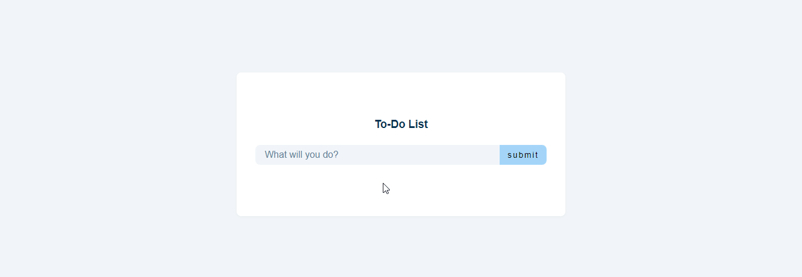

# To-Do List Application

This simple To-Do List application allows users to organize their daily tasks by adding, editing, and deleting items. Below is a README file explaining how to use the application.

---

## Usage

1. **Adding a Task:**
   - Type the task you want to add in the "What will you do?" field in the top right corner.
   - Then, click the "Submit" button to add the task to your list.

2. **Editing a Task:**
   - To edit a task, click the "Edit" button next to the task.
   - Edit the text in the opened area and click the "Edit" button again to save the update.

3. **Deleting a Task:**
   - To delete a task, click the "Delete" button next to the task.

4. **Clearing the Entire List:**
   - To clear the entire task list, click the "Clear List" button.

---

## Style and Theme

This application has a simple and user-friendly design. The light blue tones and clean white background are arranged for user convenience.

---

## Technologies and Libraries Used

- HTML
- CSS
- JavaScript
- Font Awesome
- Google Fonts 

---

## License

This project is licensed under the [MIT License](LICENSE). Check the license file for more information.

---

---

## Contribution

1. Clone this repository (`git clone https://github.com/yourusername/your-repo.git`).
2. Create a new branch (`git checkout -b new-branch`).
3. Make your changes and commit them (`git commit -m 'Description'`).
4. Push to your branch (`git push origin new-branch`).
5. Create a pull request.

---

This README file is written to guide developers in understanding how to use and contribute to the project. Happy coding!

